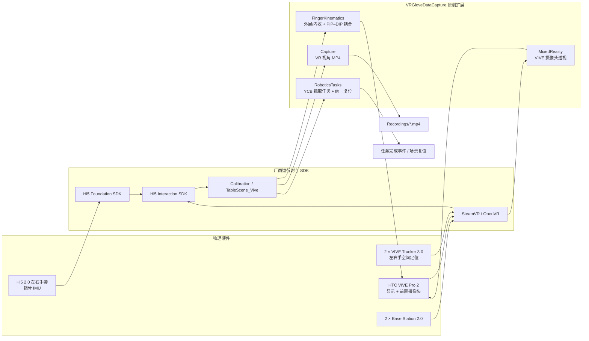

# VR Glove Data Capture

基于 **Unity、HTC VIVE Pro 2、VIVE Tracker 3.0 与 Noitom Hi5 2.0 数据手套** 的手部运动采集和机器人操作示教项目。

项目当前已经跑通从 SteamVR 设备上线、Hi5 手套接入、V-pose 校准、虚拟手驱动到桌面物体交互的完整流程，并在此基础上增加了手指运动学增强、VIVE 前置摄像头透视、VR 第一视角录像和机器人 pick-and-place 任务场景。

> - **当前推荐开发版本**：`codex/pick-place-task-scenes`
> - **Unity 固定版本**：`2019.4.18f1`
> - **主要运行方式**：Windows + SteamVR + Unity Editor Play Mode

## 项目定位

### 当前已经实现

- 使用 **Hi5 2.0 Foundation SDK** 获取手套姿态，并使用 **Hi5 2.0 Interaction SDK** 驱动虚拟手和交互物体。
- 使用左右手各一台 **VIVE Tracker 3.0** 提供手部空间定位。
- 在厂商解算结果上开放手指 **外展/内收（abduction/adduction）**，改善拇指与小指对指能力。
- 支持可选的 **PIP–DIP 比例耦合**，在传感器数量有限时获得更稳定的指尖姿态。
- 使用 VIVE Pro 2 前置摄像头实现实验性的 **video see-through** 混合现实透视。
- 使用 Unity Recorder 在 Editor Play Mode 中录制 **VR 第一视角 MP4**。
- 自动生成机器人操作任务，包括球入桶、杯放定位垫、罐入箱和颜色分类。
- 将新增任务接入 Hi5 原场景的统一复位消息和实体复位按钮。

### 当前尚未实现

- 尚未将每个 IMU 的九轴原始数据导出为 CSV、ROS bag 或其他结构化格式。
- 尚未实现完整关节轨迹、物体位姿、任务事件和视频之间的统一时间戳同步。
- 尚未形成面向受试者实验的数据分段、匿名化、元数据和批量导出工具。
- Windows Standalone Player 尚未完成与 Editor Play Mode 同等级别的硬件验证。

因此，当前版本适合作为 **VR 手部交互、任务设计和示教采集的功能基线**；结构化运动数据记录器是后续开发的核心模块。

## 系统架构

### 硬件与软件链路



### 运行时设计

项目原创功能位于 `Assets/VRGloveDataCapture`，通过自动安装器或反射桥接挂接到本地厂商 SDK：

1. **不直接修改 Hi5 厂商源码**：外展/内收模式通过运行时反射配置。
2. **不提交 Hi5 专有资源**：`Assets/NoitomHi5` 与 `Assets/Hi5_Interaction_SDK` 由用户本地导入并被 Git 忽略。
3. **不修改厂商示例 Scene**：透视组件和机器人任务台在 Play Mode 中自动加入。
4. **统一复位消息**：新增任务订阅厂商的 `messageObjectReset`，与原有实体按钮共享同一复位链路。
5. **资源可追溯**：YCB 子集保留对象 ID、下载归档哈希、文件哈希和 CC BY 4.0 署名信息。

## 主要功能

| 功能 | 默认状态与入口 | 输出或效果 | 详细文档 |
|---|---|---|---|
| **Hi5 手指外展/内收解锁** | Play Mode 自动启用 | 关闭厂商 `finger ADB fixed`，保留手指横向自由度 | [FINGER_KINEMATICS.md](docs/FINGER_KINEMATICS.md) |
| **PIP–DIP 耦合** | 可选，需要在手骨骼根节点配置组件 | 按比例约束 DIP 屈伸，同时保留其他旋转分量 | [FINGER_KINEMATICS.md](docs/FINGER_KINEMATICS.md) |
| **VIVE 视频透视** | Play Mode 按 `P` 开关，默认关闭 | 将 OpenVR Tracked Camera 视频合成到虚拟物体之后 | [MIXED_REALITY.md](docs/MIXED_REALITY.md) |
| **VR 第一视角录像** | Editor Play Mode 按 `F9` 开始/停止 | `Recordings/vr_view_*.mp4` | [VR_VIEW_RECORDING.md](docs/VR_VIEW_RECORDING.md) |
| **机器人抓取任务台** | 打开 `TableScene_Vive` 后自动生成 | 5 个可抓物体、5 个目标区及任务完成反馈 | [PICK_PLACE_TASKS.md](docs/PICK_PLACE_TASKS.md) |
| **整场任务复位** | 拍下原场景复位按钮，或按 `F8` | 恢复物体姿态、刚体状态、速度、进度和目标颜色 | [PICK_PLACE_TASKS.md](docs/PICK_PLACE_TASKS.md) |

### 机器人任务

| 任务 | 操作物体 | 目标 | 训练价值 |
|---|---|---|---|
| 球入桶 | YCB `055_baseball` | 圆形桶 | 球形抓取、搬运和释放 |
| 杯放定位垫 | YCB `025_mug` | 圆形定位垫 | 杯身/把手抓取与姿态控制 |
| 罐入箱 | YCB `005_tomato_soup_can` | 方形收纳箱 | 圆柱抓取与容器放置 |
| 颜色分类 | 红、蓝规则方块 | 对应颜色箱 | 条件分类和精确放置 |

目标底面在匹配物体进入后变为绿色，Console 会记录任务 ID 和累计完成数。当前成功判据是进入目标触发体积，尚未要求物体释放后保持静止若干帧。

## 硬件与版本要求

### 已验证配置

| 类别 | 设备或软件 | 已验证版本/数量 | 用途 |
|---|---|---|---|
| 头显 | HTC VIVE Pro 2 | 1 台 | VR 显示、头部追踪、前置摄像头透视 |
| 基站 | SteamVR Base Station 2.0 | 2 台 | Lighthouse 空间定位 |
| Tracker | VIVE Tracker 3.0 | 2 台 | 左右手空间位姿 |
| 数据手套 | Noitom Hi5 2.0 | 左右手各 1 只 | 手指姿态与交互输入 |
| Unity | Unity Editor | `2019.4.18f1` | 固定开发和运行版本 |
| SteamVR 插件 | SteamVR Unity Plugin | `2.8.2` | OpenVR 输入、相机和设备接口 |
| OpenVR XR | OpenVR XR Plugin | `1.2.3` | Unity XR 显示后端 |
| Foundation SDK | Hi5 2.0 Foundation SDK | `1.1.0.23` | Hi5 设备和基础手部数据 |
| Interaction SDK | Hi5 2.0 Interaction SDK | `1.1.0.3` | 虚拟手、抓取、碰撞和复位逻辑 |
| 录像 | Unity Recorder | `2.2.0-preview.4` | Editor Play Mode MP4 录像 |

### 兼容性约束

- 必须优先使用 **Unity `2019.4.18f1`**。Unity 6 会导致旧版 Hi5/SteamVR 插件出现 Burst、Mono.Cecil 或 `Assembly-CSharp-Editor` 解析错误。
- 项目当前以 **Windows + SteamVR** 为目标平台。
- VIVE 透视依赖 SteamVR 相机权限和 OpenVR Tracked Camera 接口，不由 Hi5 SDK 提供。
- Hi5 SDK 和用户手册不随本仓库分发，必须从授权来源取得。

## 快速开始

### 1. 获取当前开发版本

```powershell
git clone https://github.com/YushuoWang29/vr-glove-data-capture.git
cd vr-glove-data-capture
git checkout codex/pick-place-task-scenes
```

默认 `main` 当前仍是初始化基线；在功能分支合并前，应使用上述推荐分支。

### 2. 安装运行环境

1. 通过 Unity Hub 安装 **Unity `2019.4.18f1`**，包含 Windows Build Support。
2. 安装并启动 SteamVR。
3. 将 VIVE Pro 2、两个 Base Station 2.0 和两个 VIVE Tracker 3.0 配对并上线。
4. 在 SteamVR 状态窗口确认头显、基站和 Tracker 均为绿色。

### 3. 打开 Unity 项目

在 Unity Hub 中添加并打开：

```text
Unity Project/vr-glove-data-capture
```

首次打开时等待 Package Manager 恢复依赖并完成脚本编译。不要删除仓库中的 `Assets/SteamVR/OpenVRUnityXRPackage`，OpenVR XR 依赖从该本地包恢复。

### 4. 导入 Hi5 SDK

按以下顺序导入本地授权资源：

1. **Hi5 2.0 Foundation SDK `1.1.0.23`**。
2. 等待 Unity 编译完成，确认生成 `Assets/NoitomHi5`。
3. **Hi5 2.0 Interaction SDK `1.1.0.3`**。
4. 再次等待编译完成，确认生成 `Assets/Hi5_Interaction_SDK`。
5. 若 SteamVR 提示生成或更新 Input Actions，按提示保存并重新载入。

这两个厂商目录被 `.gitignore` 排除，不应强制加入 Git。

### 5. 完成手套与 Tracker 校准

1. 启动 Hi5 手套和厂商运行时，确认左右手均被识别。
2. 打开：

   ```text
   Assets/NoitomHi5/Scenes/Vive/Calibration.unity
   ```

3. 进入 Play Mode，佩戴头显。
4. 按厂商说明通过注视启动校准，并完成 V-pose/手套与 Tracker 对齐。
5. 确认左右虚拟手的位置、朝向和手指动作基本正确。

### 6. 运行完整交互与任务 Demo

打开：

```text
Assets/Hi5_Interaction_SDK/Scenes/Vive/TableScene_Vive.unity
```

进入 Play Mode 后，项目会自动执行以下扩展：

- 启用手指外展/内收模式。
- 在主相机上安装透视组件。
- 安装 `F9` VR 录像热键。
- 在原有桌面附近生成 YCB pick-and-place 任务台。
- 将新增物体注册到 Hi5 simple-object manager。
- 订阅场景原有的统一复位消息。

### 7. 常用按键

| 按键/操作 | 功能 | 成功判据 |
|---|---|---|
| `P` | 开启/关闭 VIVE 视频透视 | Console 出现 `Passthrough Streaming: LIVE` 才表示收到连续相机帧 |
| `F9` | 开始/停止 VR 第一视角录像 | `Recordings/` 中生成 MP4 |
| `F8` | 发布全场复位消息 | 新增物体、任务进度和目标颜色恢复 |
| 场景实体复位按钮 | 与 `F8` 相同的统一复位 | 原厂物体和新增任务物体同时恢复 |

## 项目目录

```text
vr-glove-data-capture/
├─ README.md
├─ LICENSE                         # 原创代码 MIT License
├─ THIRD_PARTY_NOTICES.md          # 第三方组件和数据集声明
├─ LICENSES/
│  ├─ SteamVR-BSD-3-Clause.txt
│  └─ YCB-CC-BY-4.0.txt
├─ docs/
│  ├─ SETUP.md                     # 硬件、SDK 和 Unity 配置
│  ├─ FINGER_KINEMATICS.md         # 手指自由度与 PIP–DIP 耦合
│  ├─ MIXED_REALITY.md             # VIVE 视频透视
│  ├─ VR_VIEW_RECORDING.md         # VR 第一视角录像
│  ├─ PICK_PLACE_TASKS.md          # 机器人任务和复位机制
│  └─ YCB_ASSET_MANIFEST.md        # YCB 来源、裁剪范围和哈希
└─ Unity Project/
   └─ vr-glove-data-capture/
      ├─ Assets/
      │  ├─ SteamVR/               # Valve SteamVR Unity Plugin
      │  ├─ VRGloveDataCapture/
      │  │  ├─ Runtime/
      │  │  │  ├─ FingerKinematics/
      │  │  │  ├─ MixedReality/
      │  │  │  ├─ Capture/
      │  │  │  └─ RoboticsTasks/
      │  │  ├─ Editor/             # Recorder 桥接和资源验证器
      │  │  ├─ Resources/          # YCB 轻量模型子集
      │  │  └─ Tests/PlayMode/     # 任务生成与复位冒烟测试
      │  ├─ NoitomHi5/             # 本地导入，Git 忽略
      │  └─ Hi5_Interaction_SDK/   # 本地导入，Git 忽略
      ├─ Packages/
      └─ ProjectSettings/
```

Unity 生成的 `Library`、`Temp`、`Logs`、`UserSettings`、构建输出和 `Recordings` 不进入 Git。

## 验证与测试

### Unity 菜单验证

在 Unity 中运行：

```text
Tools > VR Glove Data Capture > Validate Pick Place Task Assets
```

验证器会检查：

- 三个 YCB 模型是否能够通过 `Resources.Load` 载入。
- 模型材质是否成功关联纹理。
- `Hi5ObjectGrasp`、`Hi5Plane` 和 `Hi5ObjectTrigger` 层是否位于正确索引。
- 本地 `TableScene_Vive` 是否存在。

### Play Mode 自动测试

Test Runner 中的测试：

```text
PickPlaceTaskSceneSmokeTests.TableSceneBuildsFiveTasksAndHi5ResetRestoresTheirPoses
```

该测试会加载真实厂商场景并验证：

1. 生成 5 个可抓物体和 5 个目标区。
2. 五项匹配放置均能触发成功。
3. `messageObjectReset` 能恢复全部物体的位置和 kinematic 状态。
4. 刚体线速度与角速度归零。
5. 任务进度和目标颜色恢复。

当前开发版本已经在 Unity `2019.4.18f1` 下通过资源验证和上述 Play Mode 测试。

## 常见问题

### Unity 报 `Assembly-CSharp-Editor` 或 Mono.Cecil 解析失败

优先检查 Unity 版本。该 SDK 组合固定使用 `2019.4.18f1`；不要直接使用 Unity 6 打开旧版 Hi5 工程。

### SteamVR 中 Tracker 在线，但虚拟手位置错误

重新运行 `Calibration.unity` 的 V-pose 对齐。Tracker 在线只表示设备可见，不表示手套坐标系已经与 Tracker 对齐。

### 按 `P` 后没有真实世界画面

检查 SteamVR 的 Camera 权限并重启 SteamVR。`Passthrough is ready` 只表示组件安装完成，只有 `Passthrough Streaming: LIVE` 才表示收到了连续图像。

### 按 `F9` 没有开始录像

确认当前处于 **Unity Editor Play Mode**，并让 Game View 获得键盘焦点。录像功能依赖 Editor-only 的 Unity Recorder，不是 Windows Player 录像器。

### 机器人任务台没有生成

确认打开的 Scene 名称是 `TableScene_Vive`，并检查 Console 是否出现 `Hi5 simple-object manager did not become ready`。也可以先运行资源验证菜单定位缺失的 SDK、资源或 Layer。

## 数据与版本管理

### 数据策略

以下内容不得直接提交到源码仓库：

- 受试者身份信息和原始实验记录。
- 大规模九轴传感器数据、视频和中间导出文件。
- 标定导出、缓存和临时采集文件。
- 未经授权的厂商 SDK、PDF、安装包和示例构建。

仓库只保存源码、配置、数据结构、可再分发的小型测试资源以及明确授权的数据集子集。

### Git 工作流

- 稳定基线使用 `main`。
- 功能开发使用 `codex/<topic>` 短生命周期分支。
- 一个版本应包含代码、Unity `.meta` 文件、测试和对应文档。
- 合并前至少完成 Unity 编译、相关功能验证和 `git diff --check`。

详细约定见 [CONTRIBUTING.md](CONTRIBUTING.md)。

## 许可证与第三方资源

- 项目原创源码采用 [MIT License](LICENSE)。
- SteamVR Unity Plugin 保留 Valve 的 BSD 3-Clause 条款。
- YCB 模型子集采用 **Creative Commons Attribution 4.0 International**，并保留数据集作者署名和改动说明。
- Hi5 2.0 SDK 不随仓库分发，使用者必须遵守厂商授权条款。

完整声明见 [THIRD_PARTY_NOTICES.md](THIRD_PARTY_NOTICES.md) 和 [LICENSES](LICENSES/)。
