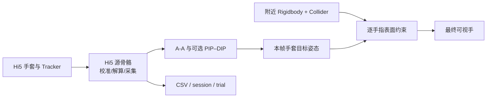

# 手–物体自适应视觉接触

## 功能结论

项目在 **Hi5 手套源骨骼**与最终显示的**可视手骨骼**之间增加了一层只读输入、只写显示的接触约束。无接触时，可视手逐帧采用手套解算姿态；手指目标姿态将进入可抓物体表面时，求解器把对应可视关节截停在最近的无穿透姿态；离开物体后再平滑回到手套姿态。

该功能在 Play Mode 中自动安装到左右可视手，不要求修改原厂 Scene 或 Hi5 prefab。

## 数据隔离保证

| 层级 | 数据或对象 | 自适应接触是否写入 | 用途 |
|---|---|---:|---|
| **Hi5 原生输入层** | `HI5_InertiaInstance.HandBones` | **否** | 手套融合姿态、校准与数据采集源 |
| **Hi5 交互层** | 抓取状态、物体 ID、碰撞状态机 | **否** | pinch、lift、release 与物体运动 |
| **项目运动学层** | A-A 解锁、可选 PIP–DIP 耦合 | **否** | 形成送往显示层的手套目标姿态 |
| **最终显示层** | `Hi5_Hand_Visible_Hand` 的手指 Transform | **是** | 仅让用户看到贴合物体表面的虚拟手 |
| **统一采集层** | `hand_bones.csv`、`joint_angles.csv` | **仍读取源骨骼** | 保留未被视觉修正污染的动作轨迹 |

因此，**视觉贴合不等于测量值修正**。导出的关节姿态仍代表 Hi5 解算及已明确配置的运动学处理，不代表物体接触反求后的显示姿态。

## 运行时流程



每一帧的处理顺序如下：

1. 在 `LateUpdate` 读取 Hi5 源指骨的局部旋转，不对源 Transform 写值。
2. 用手掌周围的非触发 Collider 做一次宽相位筛选；默认只接受绑定 Rigidbody 的外部物体。
3. 把每段指骨近似为由骨长自适应得到半径的胶囊状表面，并用三个内部采样点与 `Collider.ClosestPoint` 判断表面距离。
4. 若完整手套目标姿态无接触，直接显示目标姿态，不增加自由空间延迟。
5. 若目标会穿入物体，从 MCP/CMC 到远端关节依次进行 7 次二分搜索，寻找仍不穿透的最大姿态混合比例。
6. 接触解除后以 18 Hz 响应平滑返回手套目标；如果插值路径会再次穿透，则直接采用已确认安全的手套目标。

## 稳定性设计

| 机制 | 默认值 | 作用 |
|---|---:|---|
| 宽相位半径 | `0.28 m` | 只检查手掌附近物体，控制每帧开销 |
| 指骨半径 | 骨长的 `0.24` 倍 | 随左右手模型和骨段长度自适应 |
| 半径范围 | `4.5–10.5 mm` | 避免极短/极长骨段产生异常碰撞表面 |
| 表面间隙 | `0.8 mm` | 让网格视觉上停在物体表面之前 |
| 接触滞回 | `0.7 mm` | 抑制 Collider 边界附近的开关闪烁 |
| 二分次数 | `7` | 单关节混合比例分辨率约为 `1/128` |
| 释放响应 | `18 Hz` | 避免离开物体时发生明显跳变 |

求解器不添加关节、刚体、力、冲量或临时碰撞体，也不改变对象的抓取判定。自身可视手、Hi5 源手、Hi5 碰撞手、Trigger 与默认静态场景几何会被排除，避免手指约束到自己的碰撞体或任务目标区。

## 自动启用与运行检查

1. 打开任一包含原厂左右可视手的场景，推荐：

   ```text
   Assets/VRGloveDataCapture/Scenes/TaskSetups/PickPlaceTasks.unity
   ```

2. 进入 Play Mode。无需给 Scene 手工添加组件。
3. Console 应分别出现：

   ```text
   [AdaptiveHandContact] Adaptive visual contact is active on Hi5_Right_Hand_V.
   [AdaptiveHandContact] Adaptive visual contact is active on Hi5_Left_Hand_V.
   ```

4. 在手未接触物体时张合五指，确认可视姿态仍连续跟随手套。
5. 缓慢抓握球、杯、罐或方块，确认指骨在接近表面后停止继续穿入，而物体仍由原 Hi5 抓取逻辑移动。
6. 松手后确认手指平滑回到手套姿态，校准面板、抓取/释放和任务复位均正常。

运行时在左右可视手 GameObject 上可以看到 `AdaptiveHandContactController`。取消组件的 **Apply Visual Contact** 后，显示骨骼立即恢复直接跟随源姿态，可用于 A/B 对比。

## 参数调整边界

- 物体网格看起来仍有轻微穿入时，先把 **Surface Clearance** 从 `0.0008` 增加到 `0.0012–0.0020`，不要修改 Hi5 校准或源骨骼缩放。
- 手指悬空距离过大时，减小 **Radius To Bone Length** 或 **Surface Clearance**。
- 手靠近复杂任务台时约束对象过多，应把可抓物体放在单独 Layer，并收窄 **Contact Layers**；不要把目标 Trigger 纳入接触层。
- 低端 GPU 通常不是瓶颈；若 CPU Physics 开销明显，先减小 **Broadphase Radius**，再把 **Solver Iterations** 从 `7` 降到 `6`。
- 默认 `Require Rigidbody` 应保持开启。只有明确需要手指贴合静态环境时才关闭，并同时配置严格的 LayerMask。

## 开源实现参考

本实现没有复制第三方源码，而是采用了以下维护方公开项目中的架构原则：

1. [Valve SteamVR Unity Plugin](https://github.com/ValveSoftware/steamvr_unity_plugin) 的 Skeleton Poser/pose blending 将设备骨骼输入与应用显示姿态分层，支持在保持输入骨骼语义的同时混合特定姿态。
2. [Ultraleap Unity Plugin](https://github.com/ultraleap/UnityPlugin) 的 Physical Hands 明确区分 hard/soft/no-contact，并以 Rigidbody + Collider 作为物理交互对象边界；本项目只采用其“接触层独立”的设计思想，不引入其物理手或抓取实现。
3. [UltimateXR](https://github.com/VRMADA/ultimatexr-unity) 把对象抓取姿态与手指显示姿态作为可混合层处理，说明抓取状态与最终手模型姿态不必共用同一数据表示。

针对本项目的 Hi5 2019.4 基线，最终选择了**源/显示骨骼隔离 + 非施力表面约束 + 逐关节最大安全混合**，而没有移植完整物理手。这样可以保留已经跑通的 Hi5 校准、pinch/lift 状态机、任务复位与统一采集链路。

## 自动化验证

执行：

```text
Tools > VR Glove Data Capture > Run All Project Play Mode Tests
```

或在 Edit Mode 按 `Ctrl+Shift+F10`。其中 `AdaptiveHandContactSmokeTests` 会：

1. 加载真实 `TableScene_Vive` 并确认左右可视手均自动安装求解器。
2. 确认可视手与 Hi5 源/校准骨骼不是同一 Transform 层级。
3. 在手掌附近放置刚体碰撞探针并调用求解器，逐骨检查源骨骼没有被写入。
4. 构造食指目标姿态与小球碰撞探针，确认可视关节在表面前被截停，而源关节目标保持不变。

该测试与 pick-and-place 全场复位和统一数据 trial 落盘测试一起运行。

## 已知边界

- 这是**视觉近似**，不是精确手–物体接触力学，也不会产生触觉反馈或力估计。
- 手指表面由骨段中心线和自适应半径近似，不等价于逐三角形皮肤碰撞；极薄、极小或高凹度物体可能需要单独调整 Collider。
- 物体突然传送进手内部时，系统优先保持上一安全显示姿态并等待可释放目标，不会为了推出手指而修改源姿态或施加物理冲量。
- 该层不写入 `hand_bones.csv`/`joint_angles.csv`。如果后续研究需要同时保存“手套意图姿态”和“视觉接触姿态”，应新增独立数据流并明确命名，不能覆盖现有源数据列。
