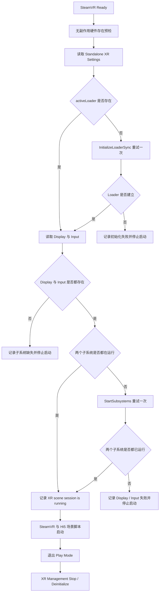

# OpenVR/XR Play Mode 生命周期与无画面排障

## 结论

本项目将 **OpenVR Scene 会话的创建和关闭权统一交给 Unity XR Management 与 OpenVR XR Loader**。进入 Play Mode 前的硬件预检只读取运行时和 HMD 是否存在，不再临时建立 `VRApplication_Background` 后调用 `OpenVR.Shutdown()`。

针对本项目在 Unity `2019.4.18f1` Editor 中实测出现的 Standalone XR Settings 空引用或 Loader 未自动启动状态，项目会在首个 Scene 加载前执行一次幂等恢复。成功启动必须同时满足：

- `XRManagerSettings.activeLoader` 不为空；
- `XRDisplaySubsystem.running == true`；
- `XRInputSubsystem.running == true`；
- Console 出现 `[XRBootstrap] XR scene session is running. Loader=Open VR Loader, display=True, input=True.`。

该修复首次记录于提交 `cd04817`。

## 故障根因

旧版 `Validate SteamVR and HMD` 为确认设备状态，曾执行以下流程：

```text
OpenVR.Init(VRApplication_Background)
→ 查询 HMD
→ OpenVR.Shutdown()
```

这不是无副作用的“检测”。它会在 Unity Editor 进程内创建并关闭一个原生 OpenVR 会话，而显示 Scene 会话本应由 OpenVR XR Loader 管理。在本项目已复现的故障链路中，旧会话关闭后 Unity XR Management 没有在下一次 Play Mode 重新建立 Loader，随后 SteamVR 脚本得到 `Not Initialized (109)`，头显也没有收到 Unity 画面。

`Allow Desktop-Only Play Once` 只绕过下一次进入 Play Mode 前的硬件预检；它不强制切换到桌面模式，也不会初始化 XR，因此不能用于修复头显无画面。

## 组件职责边界

| 组件 | 当前职责 | 明确禁止或不负责的行为 |
|---|---|---|
| `SteamVrRuntimeProbe` | 调用 `OpenVR.IsRuntimeInstalled()` 和 `OpenVR.IsHmdPresent()` | 不调用 `OpenVR.Init()`；不调用 `OpenVR.Shutdown()` |
| `OpenVrXrEditorSettingsBridge` | 当本项目 Editor 中 `XRGeneralSettings.Instance` 为空时，恢复 Standalone 配置引用 | 不创建 OpenVR 原生会话 |
| `OpenVrXrLifecycle` | 首个 Scene 前检查 Loader、Display 和 Input；必要时各重试一次初始化和启动 | 不直接调用 `OpenVR.Init(VRApplication_Scene)` |
| Unity XR Management | 正常启动、停止并反初始化 XR Loader | 不由预检代码绕过或替代 |
| SteamVR/Hi5 场景脚本 | 在 XR Scene 会话成功后读取设备、姿态和输入 | 不负责补建 Unity XR Loader |

## 启动与退出顺序



如果补救路径初始化了 Loader 或补启了 XR 子系统，项目会建立一个隐藏的生命周期对象，并在退出时幂等调用 `XRManagerSettings.DeinitializeLoader()`。它仍通过 XR Management 清理，不直接关闭 OpenVR。

## 正常运行判据

### 进入 Play Mode

依次确认以下日志或状态：

| 判据 | 正常结果 | 失败含义 |
|---|---|---|
| 硬件预检 | `OpenVR is installed and an HMD is present` | SteamVR 未安装、HMD 不可见或运行时未就绪 |
| XR Scene 会话 | `[XRBootstrap] XR scene session is running. Loader=Open VR Loader, display=True, input=True.` | Loader、Display 或 Input 尚未建立 |
| HMD 设备 | `OpenVR Headset(VIVE Pro 2)` | OpenVR Scene 会话未识别头显 |
| Tracker | 两条 `VIVE Tracker 3.0` 设备记录 | Tracker 未上线或未被 OpenVR 枚举 |

只有存在检查通过但没有 `[XRBootstrap]` 成功日志时，应优先把问题归类为 XR Loader 生命周期故障。透视组件的 `Passthrough is ready` 或 `Passthrough Streaming: LIVE` 属于后续相机链路，不能替代 XR Scene 会话判据。

### 退出 Play Mode

正常退出应出现：

```text
XR OpenVR Display Stop
XR OpenVR Display Shutdown
[XR] [OpenVR] Shutdown
```

从 VIVE 系统菜单选择“正在运行 → 退出游戏”会结束当前 Scene 会话。修复后的下一次 Play Mode 应重新建立新会话；日常开发仍建议使用 Unity 工具栏 Play 按钮退出，以便直接检查完整日志。

## 无画面恢复流程

1. 退出当前 Play Mode。
2. 等待 SteamVR 状态变为 **Ready**，并确认 HMD 在线。基站与 Tracker 状态影响后续空间定位和手部交互，但不是恢复头显视频输出的必要条件。
3. 执行 `Tools > VR Glove Data Capture > VR Runtime > Validate SteamVR and HMD`。
4. 打开 `Assets/VRGloveDataCapture/Scenes/TaskSetups/PickPlaceTasks.unity`。
5. 重新进入 Play Mode，不要选择 `Allow Desktop-Only Play Once`。
6. 以 `[XRBootstrap] XR scene session is running. Loader=Open VR Loader, display=True, input=True.` 作为 XR 软件会话成立的首要判据，并在头显中目视确认 Unity 双眼画面实际出现。

如果同一 Unity Editor 进程曾运行过提交 `cd04817` 之前的旧版预检，完整退出 Unity Editor、重启 SteamVR 并重新打开项目一次，以清除旧进程中已经发生的 Background Init/Shutdown 状态。安装修复后不需要为每一次 Play 重启 SteamVR。

## 验证记录与边界

### 已完成验证

- Unity `2019.4.18f1` PlayMode 回归：`5/5` 通过，失败 `0`、跳过 `0`。
- 实机连续两轮进入和退出 Play Mode：每轮均得到 `display=True, input=True`。
- 两轮均识别 VIVE Pro 2、两个 Base Station 2.0 和两个 VIVE Tracker 3.0。
- 两轮退出均记录 Display Stop、Display Shutdown 和 OpenVR Shutdown。

### 测试边界

`OpenVrLifecycleSmokeTests` 包含对 Loader 引用、Display 运行状态和 OpenVR System/Compositor 的条件断言；本次无 XR 批处理实跑只验证了托管 Loader 状态没有被存在预检改变，不能证明活动原生 Display 不会被关闭，也不能替代真实 HMD 的原生会话测试。完整验收仍必须结合实机的 `VRApplication_Scene`、`display=True`、`input=True`、设备枚举日志和头显目视画面。

该修复只处理 **XR Scene 会话启动和关闭**，不处理以下独立问题：

- VIVE 相机权限或透视频流未启动；
- 左右眼相机映射、纹理方向或几何配准；
- Hi5 手套校准、Tracker 角色或骨骼映射；
- Windows Standalone Player 的 XR 生命周期。

## 代码位置

```text
Assets/VRGloveDataCapture/
├─ Runtime/MixedReality/
│  ├─ SteamVrRuntimeProbe.cs
│  └─ OpenVrXrLifecycle.cs
├─ Editor/
│  ├─ VrPlayModePreflight.cs
│  └─ OpenVrXrEditorSettingsBridge.cs
└─ Tests/PlayMode/
   └─ OpenVrLifecycleSmokeTests.cs
```

## 技术依据

- [Valve OpenVR API](https://github.com/ValveSoftware/openvr/blob/master/headers/openvr.h)
- [Valve OpenVR Unity XR Plugin](https://github.com/ValveSoftware/unity-xr-plugin)
- [Unity XR Plug-in Management](https://docs.unity3d.com/Packages/com.unity.xr.management@3.2/manual/index.html)
